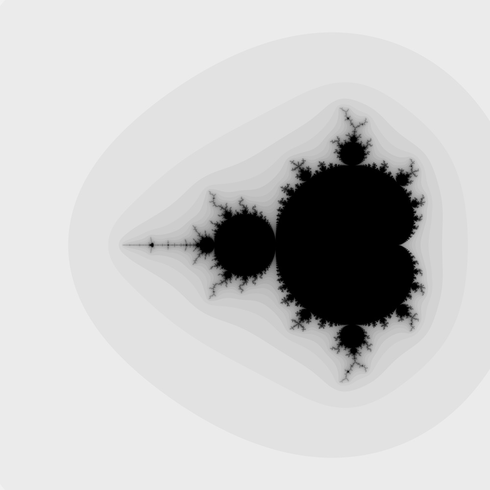

# mandelbrot set fractal

## *a multi-threaded C implementation*

[TOC]

# INTRODUCTION

This is a multi-threaded implementation of the famous [Mandelbrot set fractal](https://en.wikipedia.org/wiki/Mandelbrot_set). The goals of the project are (1) to give a simple example of a multi-threaded C programme using POSIX `pthreads`, and (2) to show how to implement mathematical software in C using a functional style. The intended audience is enterprise programmers who are experienced in JavaScript, Java, C#, and similar high-level languages who find themselves on unfamiliar grounds, needing to implement system software or scientific software using a low-level language like C.

# ORGANISATION

This project is structured as follows:

```shell
~/mandelbrot/
  LICENSE          # MIT license
  Makefile         # build script
  complex.[ch]     # complex numbers
  main.c           # main()
  mandelbrot.[ch]  # Mandelbrot set fractal
  thread.[ch]      # POSIX threads
```

This programme is written for Unix-like operating systems. I developed it on macOS. To compile and run this programme, type in the following at a Unix command prompt:

```shell
$ cd ~/mandelbrot
$ make clean all
...
$ ./mandelbrot
...
```

The programme first runs the single-threaded (serial) code and generates a [portable grey map](https://en.wikipedia.org/wiki/Netpbm) image file called `mandelbrot-s.pgm`, followed by the multi-threaded (parallel) code and generates an image file called `mandelbrot-p.pgm`. One image is the inverted greyscale version of the other. This is done so that we can visually distinguish one from the other. Mathematically, the two images are identical.



The files `complex.[ch]` implement complex arithmetic. The `Complex` record type holds two `double` values, which are interpreted either as rectangular coordinates of a complex number $c = x + jy$ (because I am an electrical engineer, I use $j$ instead of $i$) or as polar coordinates of the same complex number $c = \lvert m \rvert \angle{𝜃}$ where the phase angle $𝜃$ is measured in radians. The `ComplexKind` tag identifies the form of the complex number.

There is a pair of constructors for each form: `rOfD()` makes a rectangular form complex number from two `double` values; `rOfP()` makes a rectangular form from a polar form; similarly, `pOfD()` and `pOfR()` make a polar form. That is, `rOfP()` and `pOfR()` are dual converters. Complex, dyadic arithmetic operations `cAdd()`, `cSub()`, `cMul()`, and `cDiv()` take two complex numbers and returns one complex number. `cMod()` computes the modulus, or the magnitude, of a complex number: $\lvert c \rvert = \sqrt{x^2 + y^2}$ or $\lvert m \rvert$. `cArg()` computes the argument, or the phase angle, of a complex number: $𝜃 = tan^{-1}(y / x)$. `cConj()` computes the complex conjugate of the complex number $c$, written $c^* = x - jy = \lvert m \rvert \angle{-\theta}$. And `cSqre()` computes $c^2$. This function is used in computing the Mandelbrot set.

The file `thread.[ch]` provide a simplified interface to POSIX threads. `tRun()` function creates a new thread and, on that thread, applies its worker function argument to its data argument on a newly created thread. Typically, the worker function represents a long-running code. In a single-threaded programme, the client of a long-running function would block, awaiting the result. In a multi-threaded programme, the client—without blocking—forks off a new thread and runs the long-running function on the thread. Normally, the client would create many threads which are executed in parallel, one thread per CPU core. The client then waits for all the threads to complete execution. A record is passed into a thread via `tRun()` function's `data` argument, which is loosely typed `void*`. Inside the worker function, this argument is cast into an appropriate record pointer, and the `data` record is manipulated via that pointer, as needed. The result of the worker function is also returned via the `data` record. On my Mac equipped with a 3.2 GHz, 6-core Intel Core i7 CPU, the 1-thread version of the Mandelbrot set generator takes nearly 20 s, and the 100-thread version takes just 3 s to complete.
