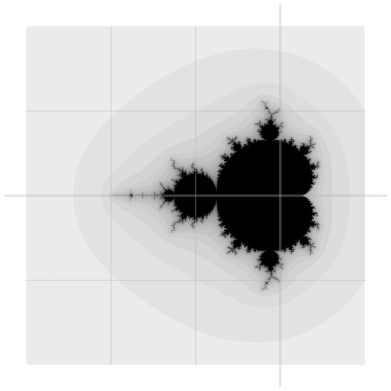

# mandelbrot set fractal

## *a multi-threaded C implementation*

[TOC]

# INTRODUCTION

This is a multi-threaded implementation of the famous [Mandelbrot set fractal](https://en.wikipedia.org/wiki/Mandelbrot_set). The goals of the project are (1) to give a simple example of a multi-threaded C programme using POSIX `pthreads`, and (2) to show how to implement mathematical software in C using a functional style. The intended audience is enterprise programmers who are experienced in JavaScript, Java, C#, and similar high-level languages who find themselves on unfamiliar grounds, needing to implement system software or scientific software using a low-level language like C.

# ORGANISATION

This project is structured as follows:

```shell
~/mandelbrot/
  LICENSE          # MIT license
  Makefile         # build script
  complex.[ch]     # complex numbers
  main.c           # main()
  mandelbrot.[ch]  # Mandelbrot set fractal
  thread.[ch]      # POSIX threads
```

This programme is written for Unix-like operating systems. I developed it on macOS. To compile and run this programme, type in the following at a Unix command prompt:

```shell
$ cd ~/mandelbrot
$ make clean all
...
$ ./mandelbrot
...
```

The programme first runs the single-threaded (serial) code and generates a [portable grey map](https://en.wikipedia.org/wiki/Netpbm) image file called `mandelbrot-s.pgm`, followed by the multi-threaded (parallel) code and generates an image file called `mandelbrot-p.pgm`. One image is the inverted greyscale version of the other. This is done so that we can visually distinguish one from the other. Mathematically, the two images are identical.

The files `complex.[ch]` implement complex arithmetic. The `Complex` record type holds two `double` values, which are interpreted either as rectangular coordinates of a complex number $c = x + jy$ (because I am an electrical engineer, I use $j$ instead of $i$) or as polar coordinates of the same complex number $c = \lvert m \rvert \angle{𝜃}$ where the phase angle $𝜃$ is measured in radians. The `ComplexKind` tag identifies the form of the complex number.

There is a pair of constructors for each form: `rOfD()` makes a rectangular form complex number from two `double` values; `rOfP()` makes a rectangular form from a polar form; similarly, `pOfD()` and `pOfR()` make a polar form. That is, `rOfP()` and `pOfR()` are dual converters. Complex, dyadic arithmetic operations `cAdd()`, `cSub()`, `cMul()`, and `cDiv()` take two complex numbers and returns one complex number. `cMod()` computes the modulus, or the magnitude, of a complex number: $\lvert c \rvert = \sqrt{x^2 + y^2}$ or $\lvert m \rvert$. `cArg()` computes the argument, or the phase angle, of a complex number: $𝜃 = tan^{-1}(y / x)$. `cConj()` computes the complex conjugate of the complex number $c$, written $c^* = x - jy = \lvert m \rvert \angle{-\theta}$. And `cSqre()` computes $c^2$. This function is used in computing the Mandelbrot set.

The file `thread.[ch]` provide a simplified interface to POSIX threads. `tRun()` function creates a new thread and, on that thread, applies its worker function argument to its data argument on a newly created thread. Typically, the worker function represents a long-running code. In a single-threaded programme, the client of a long-running function would block, awaiting the result. In a multi-threaded programme, the client—without blocking—forks off a new thread and runs the long-running function on the thread. Normally, the client would create many threads which are executed in parallel, one thread per CPU core. The client then waits for all the threads to complete execution. A record is passed into a thread via `tRun()` function's `data` argument, which is loosely typed `void*`. Inside the worker function, this argument is cast into an appropriate record pointer, and the `data` record is manipulated via that pointer, as needed. The result of the worker function is also returned via the `data` record.

# MATHEMATICS

The Mandelbrot set fractal is named after its discoverer, [Benoît Mandelbrot](https://en.wikipedia.org/wiki/Benoit_Mandelbrot), a Polish-born American mathematician, who is known for his work in the fields of fractal geometry, chaos theory, and complex analysis.

A [fractal](https://en.wikipedia.org/wiki/Fractal) is a geometric object that is recursively self similar at any scale. That is, a zoomed in version of a fractal contains similar, but smaller and differently oriented, copies of the original. Remarkably, a fractal exhibits self similarity at all scales. Fractals exist in nature: coastlines, ice crystals, broccoli heads, to name a few. And there are many mathematical fractals: Julia set, von Koch curve, Sierpiński triangle, etc. The Mandelbrot set $M$—that dark region in the image below—is the most famous of them all. The self similarity of $M$ is self evident.



Although the mathematics that underlies the Mandelbrot set is intricate and expansive, the expression for computing the set $M$ is simple: $z \leftarrow z^2 + c$, where $z$ and $c$ are both complex numbers. This simple expression describes are rather complex (pun intended) dynamic, iterative process.

First, we define a square region on the complex $c$-plane, with the top-left corner at $-3.0 + j2.0$ and the bottom-right corner at $+1.0 - j2.0$. Hence, this region is $4.0 \times 4.0$ in size. Next, we select a complex number $c$ from this region, say the top-left corner. Then, we iterate the expression $z \leftarrow z^2 + c$, where $c$ is the value selected and the initial value of $z$ is set to the origin $0.0 + j0.0$ of the $c$-plane. In mathematics, to iterate a function $f$ on an argument $x$ is to compute $f \circ f \circ ... f\ x$. In functional programming, we may write `x |> f |> f |> ... |> f`, where `|>` means pipe-right.

We terminate the process either when we have iterated a fixed number of times or when the result meets a certain criterion. As we iterate, the value of $z$ chaotically hops about the $c$-plane, and eventually reaching one of these states: falls into the origin if $c$ is selected from inside the set $M$; endlessly swirls along the boundary of $M$ of $c$ itself is on the boundary; or escapes to $∞$ if $c$ is outside $M$. Here, we iterate $100$ times or until $\lvert z \rvert > 10.0$, whichever comes first. The plot below shows the trajectory of $z$ for $c = -0.74543 + j0.11301$, which is in a neighbourhood of $M$ called the [Seahorse Valley](https://upload.wikimedia.org/wikipedia/commons/5/5b/Mandel_zoom_03_seehorse.jpg), for the repeated seahorse shapes that dot all along the boundary of $M$ in this neighbourhood. Those blue dots that indicate the trajectory of $z$ do indeed resemble a pair of seahorses.


When the iteration for a specific $c$ terminates, we associate the final iteration index, referred to as the *escape time*, with the location on the $c$-plane corresponding that $c$. Then, we select another $c$ value, say a small distance $𝛿$ away from the value used in the previous iteration, and repeat the process. We do this until the whole $4.0 \times 4.0$ region has been iterated over in this manner, thus obtaining a map of escape times for all values of $c$ within the region. Mapping these escape times from their original range $[0, 100]$ to the new range $[0, 255]$ yields a viewable greyscale Mandelbrot set, as shown above. We use $𝛿 = 0.001$ here, so we get $4.0\ ÷\ 0.001 = 4,000$ pixels per side of the image.

We may think of our Mandelbrot set generator as a zooming microscope: the $4.0 \times 4.0$ region of interest on the $c$-plane is like the objective lens and the $4,000 \times 4,000$ window on the computer display is like the eyepiece. We can zoom out by expanding the region of interest, and zoom in by contracting it. Whatever the zoom level, we still have the same image size. If we zoom out far enough, the entire Mandelbrot set shrinks down to a dot, and the grey rings that wrap the set look more and more circular. That way lies nothing of interest. The joy of studying the Mandelbrot set is to zoom in, deeper and deeper. Using a simple, immediate-mode GUI, like [Nuklear](https://github.com/Immediate-Mode-UI/Nuklear), it is fairly straightforward to add to our programme an image display with a click-to-zoom functionality.
